# Proposed Solution: The NyayaSahayak Agent

## Vision Statement

> **An Agentic AI Legal Assistant that automates the *entire lifecycle* of minor legal workflows—not just giving advice, but acting as a trusted proxy capable of fetching data, making decisions based on laws, and executing tasks.**

---

## What Makes NyayaSahayak Different?

### Traditional Chatbots vs. Agentic AI

| Feature | Traditional Legal Chatbot | NyayaSahayak Agent |
|---------|--------------------------|-------------------|
| **Advice** | Generic information | Personalized, document-backed |
| **Documents** | User uploads manually | Agent fetches from DigiLocker |
| **Accuracy** | May hallucinate | Grounded in verified data + laws |
| **Action** | Suggests steps | Executes tasks autonomously |
| **Legal Backing** | None | Cites specific Act/Section |

---

## Core Concept: The "Verify-then-Act" Loop

The Agent does **not** just hallucinate a draft. It grounds every action in:

1. ✅ **Verified State Data** (via DigiLocker)
2. ✅ **Codified Law** (BNS/Consumer Acts/Motor Vehicles Act)


---

## Detailed Workflow (Agentic Architecture)

### Step 1: Trigger (Perception)

**User initiates with natural language:**

```
"I need a rental agreement for my new flat in Pune"
"I just got a wrong challan for speeding"
"I need a gap certificate affidavit for college admission"
```

The Agent:
- Understands **intent** (rental agreement, challan dispute, affidavit)
- Identifies **jurisdiction** (Maharashtra, Karnataka, Central)
- Determines **required documents** (Aadhaar, PAN, DL, Marksheet)

---

### Step 2: Autonomous Verification (Tool Use)

**Crucial Difference:** The user does **not** upload files. The Agent pulls verified XML data directly from the source.

```mermaid
sequenceDiagram
    participant User
    participant Agent
    participant DigiLocker
    
    User->>Agent: "I need a rental agreement"
    Agent->>User: Request DigiLocker permission
    User->>Agent: Grant consent
    Agent->>DigiLocker: OAuth 2.0 Authentication
    DigiLocker-->>Agent: Access Token
    Agent->>DigiLocker: Fetch Aadhaar XML
    DigiLocker-->>Agent: Verified Aadhaar Data
    Agent->>DigiLocker: Fetch PAN XML
    DigiLocker-->>Agent: Verified PAN Data
    Agent->>Agent: Process in ephemeral memory
    Agent->>User: "Documents verified ✓"
```



**Key Features:**
- **OAuth 2.0 Auth Flow** - Secure user consent
- **XML/JSON Parsing** - Machine-readable, not just PDF
- **Ephemeral Processing** - PII never persisted

---

### Step 3: Legal Reasoning (The Brain)

The Agent's **RAG-powered legal brain**:

1. **Identifies Jurisdiction**
   ```
   Query: "flat in Pune"
   → State: Maharashtra
   → Applicable: Maharashtra Rent Control Act, 1999
   ```

2. **Cross-references Legal Requirements**
   ```
   Check: Is tenant of legal age? (DOB from Aadhaar)
   Check: Does address match? (Aadhaar vs. Property)
   Check: Is PAN valid for financial agreement? (PAN status)
   ```

3. **Retrieves Relevant Law Sections**
   ```
   Pinecone Vector Search:
   "rental agreement stamp duty Maharashtra"
   → Section 15: Standard Rent Determination
   → Stamp Duty: 0.25% of rent
   ```

---

### Step 4: Execution (Action)

The Agent **auto-populates** the legal template with **100% accuracy** using fetched data:

```yaml
Rental Agreement Draft:
  Landlord:
    Name: [USER INPUT]
    Address: [USER INPUT]
    PAN: [VERIFIED FROM DIGILOCKER]
  
  Tenant:
    Name: "Rahul Sharma" ← [FROM AADHAAR XML]
    Address: "Flat 302, Kumar Heights..." ← [FROM AADHAAR XML]
    PAN: "ABCDE1234F" ← [FROM PAN XML]
    Date of Birth: "1995-05-15" ← [FROM AADHAAR XML]
  
  Property:
    Address: [USER INPUT]
    Monthly Rent: [USER INPUT]
    Security Deposit: [CALCULATED: 2x Rent]
  
  Legal Compliance:
    Under: "Maharashtra Rent Control Act, 1999"
    Stamp Duty: ₹500 (calculated)
    Registration: Required if term > 11 months
```

**Output:**
- 📄 **PDF Ready for e-Signing**
- 📜 **Legal Citations Embedded**
- ✅ **Compliance Checklist**

---

## Agent Architecture

```
┌─────────────────────────────────────────────────────────────────┐
│                        NyayaSahayak Agent                        │
├─────────────────────────────────────────────────────────────────┤
│                                                                  │
│  ┌──────────────────────────────────────────────────────────┐   │
│  │                  LangGraph Orchestrator                   │   │
│  │  ┌────────┐ ┌────────┐ ┌────────┐ ┌────────┐ ┌────────┐ │   │
│  │  │ Intent │→│  Doc   │→│ Legal  │→│ Draft  │→│ Review │ │   │
│  │  │ Parse  │ │ Fetch  │ │Reason  │ │  Gen   │ │ Output │ │   │
│  │  └────────┘ └────────┘ └────────┘ └────────┘ └────────┘ │   │
│  └──────────────────────────────────────────────────────────┘   │
│                              │                                   │
│              ┌───────────────┼───────────────┐                  │
│              ▼               ▼               ▼                  │
│  ┌──────────────┐ ┌──────────────┐ ┌──────────────┐             │
│  │  DigiLocker  │ │   Pinecone   │ │   Template   │             │
│  │     Tool     │ │   RAG Tool   │ │   Generator  │             │
│  └──────────────┘ └──────────────┘ └──────────────┘             │
│                                                                  │
└─────────────────────────────────────────────────────────────────┘
```

---

## Supported Use Cases (MVP)

### 1. 📋 Legal Document Generation
- Rental Agreements
- Affidavits (Gap Certificate, Name Change, Address Proof)
- Consumer Complaint Letters

### 2. 🚗 Traffic Stop Assistance
- Real-time document display
- Legal citation for officer
- Challan dispute filing

### 3. ❓ Legal Q&A
- "What are my rights as a tenant?"
- "What is the penalty for driving without insurance?"

---

## Unique Value Propositions

| # | Value | How We Deliver |
|---|-------|----------------|
| 1 | **Zero Manual Entry** | DigiLocker API integration |
| 2 | **100% Accurate Data** | Verified government sources |
| 3 | **Legal Grounding** | RAG with Indian Law database |
| 4 | **Privacy First** | Ephemeral PII processing |
| 5 | **Instant Access** | <10 second response time |
| 6 | **Multilingual** | Hindi + English support |

---

## The NyayaSahayak Promise

> **"From confusion to clarity in under a minute."**

We transform the legal experience from:
- ❌ Days of running to lawyers
- ❌ Hours of paperwork
- ❌ Thousands in consultation fees

To:
- ✅ Minutes on your smartphone
- ✅ Verified data auto-filled
- ✅ Legal documents ready to sign

---

*Document prepared for hackathon submission - February 2026*
