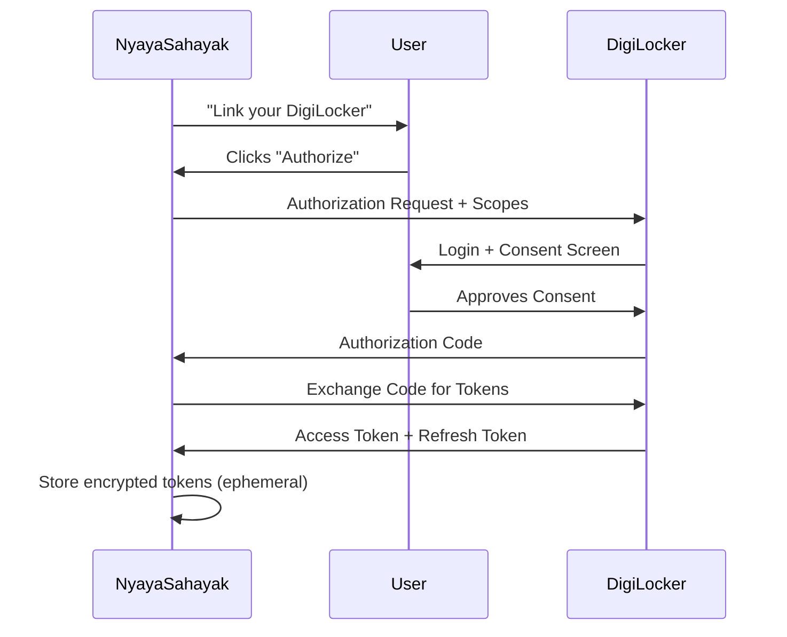

# Technical Requirements

## Overview

To build NyayaSahayak, we need a stack that supports **secure data handling**, **agentic orchestration**, and **legal accuracy**.

---

## A. Functional Requirements (The "Must-Haves")

### 1. DigiLocker Integration (API Setu)

#### OAuth 2.0 Authentication Flow
- Secure user consent mechanism
- No credential storage on our servers
- Token refresh handling



#### Document Fetching Capabilities

| Document Type | API Endpoint | Data Format | Key Fields |
|---------------|--------------|-------------|------------|
| Aadhaar | `/pull/aadhaar` | XML | Name, Address, DOB, Photo |
| PAN Card | `/pull/pan` | XML | Name, PAN Number, DOB |
| Driving License | `/pull/dl` | XML | Name, DL Number, Validity, Vehicle Class |
| Vehicle RC | `/pull/rc` | XML | Owner Name, Vehicle No, Insurance |
| Insurance | `/pull/insurance` | XML | Policy No, Validity, Coverage |
| Class X Marksheet | `/pull/marksheet-10` | XML | Name, Year, School, Marks |
| Class XII Marksheet | `/pull/marksheet-12` | XML | Name, Year, School, Marks |

> **Important:** We need **XML/JSON format**, not just PDF, for machine readability.

---

### 2. Agent Orchestrator Framework

#### Framework Selection: LangGraph

**Why LangGraph over alternatives:**

| Feature | LangGraph | LangChain | AutoGen |
|---------|-----------|-----------|---------|
| State Management | ✅ Built-in | ⚠️ Manual | ⚠️ Complex |
| Checkpointing | ✅ Native | ❌ Custom | ⚠️ Partial |
| Tool Management | ✅ Excellent | ✅ Good | ✅ Good |
| Human-in-loop | ✅ Native | ⚠️ Custom | ⚠️ Custom |

#### Agent State Machine

```python
from langgraph.graph import StateGraph, END

# Define agent states
class AgentState(TypedDict):
    messages: list
    documents: dict
    legal_context: dict
    draft: str
    status: str

# Build workflow
workflow = StateGraph(AgentState)
workflow.add_node("intent_parser", parse_intent)
workflow.add_node("doc_fetcher", fetch_documents)
workflow.add_node("legal_reasoner", reason_with_law)
workflow.add_node("draft_generator", generate_draft)
workflow.add_node("reviewer", human_review)

# Define edges
workflow.add_edge("intent_parser", "doc_fetcher")
workflow.add_conditional_edges("doc_fetcher", check_docs)
workflow.add_edge("legal_reasoner", "draft_generator")
workflow.add_edge("draft_generator", "reviewer")
```

---

### 3. Vector Database for Legal RAG

#### Database: Pinecone

**Index Configuration:**
```yaml
Index: nyayasahayak-legal
Dimension: 1536  # OpenAI text-embedding-3-small
Metric: cosine
Namespaces:
  - bharatiya_nyaya_sanhita  # BNS 2023
  - motor_vehicles_act       # MVA 1988 + 2019 Amendment
  - consumer_protection_act  # CPA 2019
  - rent_control_acts        # State-wise
  - information_technology   # IT Act 2000
```

#### Legal Knowledge Indexed

| Act/Law | Sections | Status |
|---------|----------|--------|
| Bharatiya Nyaya Sanhita (BNS) 2023 | All 358 sections | 📅 To Index |
| Motor Vehicles Act, 1988 + 2019 Amendment | All sections | 📅 To Index |
| Consumer Protection Act, 2019 | All sections | 📅 To Index |
| Maharashtra Rent Control Act | Key sections | 📅 To Index |
| Karnataka Rent Control Act | Key sections | 📅 To Index |
| IT Act, 2000 (Rule 9A) | Relevant rules | 📅 To Index |

#### Vector Search Example

```python
# Query: "What is the penalty for driving without insurance?"
query_embedding = embed("driving without insurance penalty")

results = pinecone_index.query(
    vector=query_embedding,
    top_k=5,
    namespace="motor_vehicles_act",
    include_metadata=True
)

# Returns:
# Section 196: Penalty for driving uninsured vehicle
# Section 146: Requirements for insurance
```

---

### 4. OCR & Multimodal Input

#### Use Case
User uploads a photo of a physical challan/notice that the agent can:
1. Extract text via OCR
2. Cross-reference with DigiLocker data
3. Identify discrepancies

#### Technology: Google Vision API

```python
from google.cloud import vision

def extract_challan_data(image_bytes):
    client = vision.ImageAnnotatorClient()
    image = vision.Image(content=image_bytes)
    response = client.text_detection(image=image)
    
    # Parse structured data
    return {
        "vehicle_number": extract_field(response, r"[A-Z]{2}\d{2}[A-Z]{2}\d{4}"),
        "challan_number": extract_field(response, r"CHALLAN\s*NO[:\s]+(\w+)"),
        "violation": extract_field(response, r"VIOLATION[:\s]+(.+)"),
        "amount": extract_field(response, r"FINE[:\s]+₹?(\d+)")
    }
```

---

## B. Non-Functional Requirements (The "Constraints")

### 1. Zero-Retention Privacy (CRITICAL)

> **⚠️ The Agent MUST process DigiLocker data in ephemeral memory (RAM) only. PII should NEVER be written to database logs.**

#### Implementation Strategy

```
┌─────────────────────────────────────────────────────────────┐
│                    DATA CLASSIFICATION                       │
├───────────────────┬───────────────────┬─────────────────────┤
│     RED ZONE      │   YELLOW ZONE     │    GREEN ZONE       │
│      (PII)        │   (Sensitive)     │    (General)        │
├───────────────────┼───────────────────┼─────────────────────┤
│ • Aadhaar Number  │ • Phone hash      │ • Template ID       │
│ • Full Name       │ • Email (hashed)  │ • Intent metadata   │
│ • Address         │ • Document URIs   │ • Status flags      │
│ • DOB             │ • Consent IDs     │ • Timestamps        │
│ • Photograph      │ • Session tokens  │ • Legal citations   │
├───────────────────┼───────────────────┼─────────────────────┤
│ Storage:          │ Storage:          │ Storage:            │
│ Redis ONLY        │ MongoDB           │ MongoDB             │
│ TTL: 5 minutes    │ (encrypted)       │ (plain)             │
│ NO LOGGING        │ Audit logged      │ Full logging        │
└───────────────────┴───────────────────┴─────────────────────┘
```

#### Redis Ephemeral Storage

```python
class EphemeralPIIStore:
    def __init__(self, redis_client):
        self.redis = redis_client
        self.PII_TTL = 300  # 5 minutes max
    
    async def store_pii(self, user_id: str, request_id: str, data: dict):
        key = f"pii:{user_id}:{request_id}"
        encrypted_data = self.encrypt(json.dumps(data))
        await self.redis.setex(key, self.PII_TTL, encrypted_data)
    
    async def get_pii(self, user_id: str, request_id: str) -> dict:
        key = f"pii:{user_id}:{request_id}"
        encrypted_data = await self.redis.get(key)
        if encrypted_data:
            return json.loads(self.decrypt(encrypted_data))
        return None
    
    async def delete_pii(self, user_id: str, request_id: str):
        key = f"pii:{user_id}:{request_id}"
        await self.redis.delete(key)
```

---

### 2. Hallucination Guardrails

> **Legal advice MUST cite the specific Act/Section. If confidence is low, fallback to "Please consult a human lawyer."**

#### Implementation

```python
class LegalGuardrails:
    CONFIDENCE_THRESHOLD = 0.75
    
    def validate_response(self, response: dict) -> dict:
        # Check 1: Does response contain citations?
        if not response.get("citations"):
            return self.escalate_to_human(
                "No legal citations found. Please consult a lawyer."
            )
        
        # Check 2: Are citations from our verified index?
        for citation in response["citations"]:
            if not self.verify_citation(citation):
                return self.escalate_to_human(
                    f"Cannot verify citation: {citation}"
                )
        
        # Check 3: Is confidence above threshold?
        if response["confidence"] < self.CONFIDENCE_THRESHOLD:
            return self.add_disclaimer(response)
        
        return response
    
    def add_disclaimer(self, response: dict) -> dict:
        response["disclaimer"] = (
            "⚠️ This information is provided for general guidance only. "
            "For your specific situation, please consult a qualified lawyer."
        )
        return response
```

---

### 3. Latency Requirements

> **"On-spot" means <10 seconds response time for retrieving a document and citing a rule.**

#### Performance Budget

| Operation | Target Latency | Strategy |
|-----------|---------------|----------|
| DigiLocker Auth Check | 200ms | Cached session |
| Document Fetch | 2s | Parallel API calls |
| Vector Search | 500ms | Pinecone serverless |
| LLM Response | 3s | Streaming response |
| Template Generation | 1s | Pre-compiled templates |
| **Total E2E** | **<10s** | **Optimized pipeline** |

#### Optimization Strategies

1. **Parallel Document Fetching**
   ```python
   async def fetch_all_documents(doc_types: list):
       tasks = [fetch_document(dt) for dt in doc_types]
       return await asyncio.gather(*tasks)
   ```

2. **Cached Legal Search**
   ```python
   # Cache common queries
   @cache(ttl=86400)  # 24 hours
   async def search_legal(query: str) -> list:
       return await pinecone.query(embed(query))
   ```

3. **Streaming Responses**
   ```python
   async def stream_response(query: str):
       async for chunk in llm.stream(query):
           yield chunk
   ```

---

## Technology Stack Summary

| Layer | Technology | Justification |
|-------|------------|---------------|
| **API Framework** | FastAPI | Async, OpenAPI docs, Python |
| **Agent Framework** | LangGraph | Stateful orchestration |
| **LLM** | Google Gemini / GPT-4 | Reasoning, function calling |
| **Primary Database** | MongoDB Atlas | Flexible schema, geo-queries |
| **Vector Database** | Pinecone | Low latency, serverless |
| **Cache** | Redis | Ephemeral PII, sessions |
| **OCR** | Google Vision API | Multilingual, high accuracy |
| **Auth** | OAuth 2.0 + JWT | DigiLocker compatible |

---

## Compliance Requirements

### Data Protection Digital Personal Data Protection Act (DPDPA) 2023

| Requirement | Our Implementation |
|-------------|-------------------|
| Purpose Limitation | Consent-specific document access |
| Data Minimization | Fetch only required documents |
| Storage Limitation | Ephemeral processing, no PII persistence |
| Right to Erasure | Auto-delete after 5 minutes |
| Consent Management | Explicit user-granted DigiLocker consent |

---

*Document prepared for hackathon submission - February 2026*
