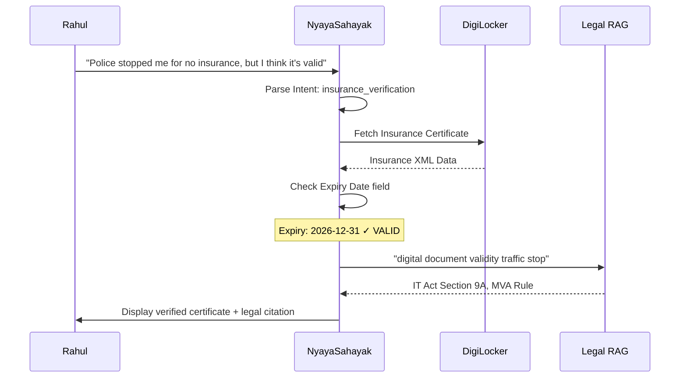
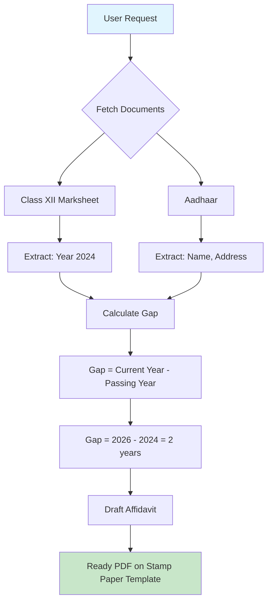
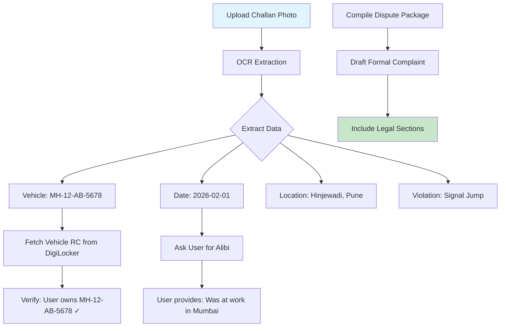

# Detailed Use Case Examples

## Overview

This document provides in-depth scenarios demonstrating how NyayaSahayak transforms real-world legal challenges into seamless, verified solutions.

---

## Scenario A: The Traffic Stop

### Context
Rahul is driving in Mumbai when he gets stopped by a traffic police officer who claims his insurance has expired.

### Traditional Experience 😰
```
Officer: "Show me your insurance"
Rahul: "Sir, it's on my phone, let me find the PDF..."
[5 minutes of scrolling through downloads]
Rahul: "Here it is!"
Officer: "This PDF could be fake. Pay the fine."
Rahul: [Pays ₹2000 or argues for 30 minutes]
```

### NyayaSahayak Experience 🚀

#### User Query
```
"Police stopped me for no insurance, but I think it's valid."
```

#### Agent Workflow



#### Agent Output

```
┌─────────────────────────────────────────────────────────────────┐
│ ✅ YOUR INSURANCE IS VALID                                      │
├─────────────────────────────────────────────────────────────────┤
│                                                                  │
│ 📋 Insurance Details:                                           │
│   • Policy Number: ICICI/1234567890                             │
│   • Vehicle: MH-12-AB-1234                                      │
│   • Valid From: 01-Jan-2026                                     │
│   • Valid Until: 31-Dec-2026                                    │
│   • Status: ✅ ACTIVE                                           │
│                                                                  │
├─────────────────────────────────────────────────────────────────┤
│ 🏛️ Legal Backing (Show to Officer):                            │
│                                                                  │
│ "Officer, under Rule 9A of the Information Technology           │
│ (Reasonable Security Practices and Procedures and               │
│ Sensitive Personal Data or Information) Rules, 2011,            │
│ documents from DigiLocker are legally equivalent to             │
│ originals. This certificate is issued by ICICI Lombard          │
│ and verified by the Government of India."                       │
│                                                                  │
│ Additionally, Section 139 of the Motor Vehicles Act,            │
│ 1988 recognizes electronic records of insurance.                │
│                                                                  │
├─────────────────────────────────────────────────────────────────┤
│ [📸 Show to Officer]  [📄 File Complaint if Harassed]          │
└─────────────────────────────────────────────────────────────────┘
```

### Impact
- ⏱️ **Time saved:** 30 minutes → 30 seconds
- 💰 **Money saved:** ₹2,000 potential bribe
- 😌 **Stress reduced:** Confidence vs. anxiety

---

## Scenario B: The "Instant" Affidavit

### Context
Priya needs a gap certificate affidavit for her college admission. She passed Class XII in 2024 and is applying in 2026.

### Traditional Experience 😰
```
Day 1: Find a typing center
Day 2: Get notarized paper
Day 3: Calculate gap years
Day 4: Draft affidavit
Day 5: Corrections (wrong year!)
Day 6: Final print
Day 7: Notary stamp
Total: 7 days, ₹500-1000
```

### NyayaSahayak Experience 🚀

#### User Query
```
"I need a gap certificate affidavit for my college admission"
```

#### Agent Workflow



#### Data Extraction

```yaml
From Class XII Marksheet (DigiLocker):
  Name: "Priya Sharma"
  Board: "CBSE"
  Roll Number: "12345678"
  Year of Passing: "2024"
  School: "Delhi Public School, Pune"
  Percentage: "89.6%"

From Aadhaar (DigiLocker):
  Name: "Priya Sharma"
  Father's Name: "Rajesh Sharma"
  Address: "Flat 302, Kumar Heights, Pune 411001"
  Date of Birth: "2006-03-15"

Calculated:
  Current Year: 2026
  Gap Years: 2026 - 2024 = 2 years
  Reason: "Personal family circumstances"
```

#### Generated Affidavit

```
┌─────────────────────────────────────────────────────────────────┐
│                         AFFIDAVIT                                │
│                    (Gap Certificate)                             │
├─────────────────────────────────────────────────────────────────┤
│                                                                  │
│ I, PRIYA SHARMA, D/o RAJESH SHARMA, aged 19 years,             │
│ residing at Flat 302, Kumar Heights, Pune 411001,               │
│ do hereby solemnly affirm and declare as under:                 │
│                                                                  │
│ 1. That I passed my Class XII examination from CBSE            │
│    Board in the year 2024 with Roll Number 12345678.           │
│                                                                  │
│ 2. That there is a gap of 2 (TWO) years between my             │
│    Class XII passing year and the current academic              │
│    session 2026.                                                 │
│                                                                  │
│ 3. That during this period, I was not enrolled in any          │
│    educational institution and the gap was due to               │
│    personal family circumstances.                                │
│                                                                  │
│ 4. That I have not been involved in any criminal or            │
│    anti-national activities during this period.                 │
│                                                                  │
│ I solemnly affirm that the contents of this affidavit          │
│ are true and correct to the best of my knowledge and           │
│ belief.                                                          │
│                                                                  │
│ DEPONENT                                                         │
│                                                                  │
│ Verified at __________ on this ____ day of _________, 2026      │
│                                                                  │
├─────────────────────────────────────────────────────────────────┤
│ 📝 Next Steps:                                                  │
│ 1. Print on ₹100 stamp paper (or use e-Stamp)                  │
│ 2. Sign in presence of Notary Public                            │
│ 3. Get notary attestation                                       │
│                                                                  │
│ [📥 Download PDF]  [🏛️ Find Nearest Notary]  [📜 e-Stamp]     │
└─────────────────────────────────────────────────────────────────┘
```

### Impact
- ⏱️ **Time saved:** 7 days → 5 minutes
- 💰 **Money saved:** ₹500 → ₹0 (drafting cost)
- ✅ **Accuracy:** 100% (no typos, calculated gap)

---

## Scenario C: The Wrong Challan

### Context
Amit receives a challan SMS for "signal jumping" at a location he never visited on that date.

### Traditional Experience 😰
```
Step 1: Visit traffic police station (2 hours)
Step 2: Explain discrepancy (ignored)
Step 3: Pay ₹5000 fine or fight for weeks
Step 4: Give up and pay
```

### NyayaSahayak Experience 🚀

#### User Query
```
User uploads photo of challan
"This challan is wrong. I wasn't at this location."
```

#### Agent Workflow



#### OCR Extracted Data

```yaml
Challan Analysis:
  Challan Number: PNE/2026/0000123
  Vehicle Number: MH-12-AB-5678
  Date: 01-Feb-2026, 3:45 PM
  Location: Signal #42, Hinjewadi Circle, Pune
  Violation: Traffic Signal Violation (Red Light)
  Fine Amount: ₹5,000
  
DigiLocker Verification:
  RC Owner: Amit Patel ✓
  Vehicle: MH-12-AB-5678 ✓
  Vehicle Type: Swift Dzire
  
User Claim:
  Date: 01-Feb-2026
  Location: Office - TCS, Andheri, Mumbai
  Evidence: Can provide office attendance records
```

#### Agent Output

```
┌─────────────────────────────────────────────────────────────────┐
│ ⚠️ CHALLAN DISPUTE PACKAGE                                      │
├─────────────────────────────────────────────────────────────────┤
│                                                                  │
│ 📋 Discrepancy Identified:                                      │
│                                                                  │
│ Challan Claims          vs.    Your Evidence                    │
│ ─────────────────────────────────────────────────               │
│ Pune, 01-Feb-2026              Mumbai (same date)               │
│ 3:45 PM                        Office hours                     │
│                                                                  │
│ This indicates a possible case of:                              │
│ • Duplicate number plate                                        │
│ • Clerical error in ANPR system                                 │
│ • Wrong vehicle identification                                   │
│                                                                  │
├─────────────────────────────────────────────────────────────────┤
│ 🏛️ Legal Basis for Dispute:                                    │
│                                                                  │
│ Under Section 200 of the Motor Vehicles Act, 1988,              │
│ you have the right to contest any traffic violation             │
│ within 60 days of issuance.                                     │
│                                                                  │
│ Under CrPC Section 244, false evidence in a legal               │
│ proceeding is punishable. If the challan is based on            │
│ incorrect ANPR data, the authority must provide proof.          │
│                                                                  │
├─────────────────────────────────────────────────────────────────┤
│ 📝 Generated Documents:                                         │
│                                                                  │
│ 1. Formal Dispute Letter to Traffic ACP, Pune                   │
│ 2. RTI Application for ANPR footage evidence                    │
│ 3. Evidence checklist for your defense                          │
│                                                                  │
│ [📥 Download Dispute Letter]  [📥 Download RTI Application]    │
└─────────────────────────────────────────────────────────────────┘
```

### Impact
- ⏱️ **Time saved:** Weeks → 10 minutes to file
- 💰 **Money saved:** ₹5,000 potential unwarranted fine
- 🏛️ **Empowerment:** Know your legal rights

---

## Scenario D: The Rental Agreement

### Context
Neha is moving to a new flat in Bangalore and needs a rental agreement with her landlord.

### User Query
```
"I need a rental agreement for my new flat in Bangalore. 
Monthly rent is ₹25,000 with ₹50,000 security deposit."
```

#### Agent Workflow

1. **Document Fetch**
   - Tenant Aadhaar (name, current address)
   - Tenant PAN (financial transactions)

2. **User Input Collection**
   - Landlord details
   - Property address
   - Rent amount, deposit
   - Agreement duration

3. **Legal Application**
   - Karnataka Rent Control Act, 2001
   - Stamp duty calculation: 1% of annual rent
   - Registration requirement: Mandatory for 12+ months

#### Generated Agreement Summary

| Section | Auto-Filled | Source |
|---------|------------|--------|
| Tenant Name | Neha Sharma | Aadhaar |
| Tenant Address (Permanent) | Delhi 110001 | Aadhaar |
| Tenant PAN | ABCDE1234F | PAN Card |
| Landlord Name | [User Input] | Manual |
| Property Address | [User Input] | Manual |
| Monthly Rent | ₹25,000 | User Input |
| Security Deposit | ₹50,000 | User Input |
| Agreement Period | 11 months | Optimized for no registration |
| Stamp Duty | ₹2,750 | Calculated |

---

## Summary: Before vs. After

| Scenario | Before NyayaSahayak | After NyayaSahayak |
|----------|-------------------|-------------------|
| Traffic Stop | 30 min argument + potential bribe | 30 sec verified display |
| Affidavit | 7 days + ₹500-1000 | 5 min + ₹0 drafting |
| Wrong Challan | Weeks of running around | 10 min dispute package |
| Rental Agreement | ₹2000-5000 lawyer fee | ₹0 with verified data |

---

*Document prepared for hackathon submission - February 2026*
