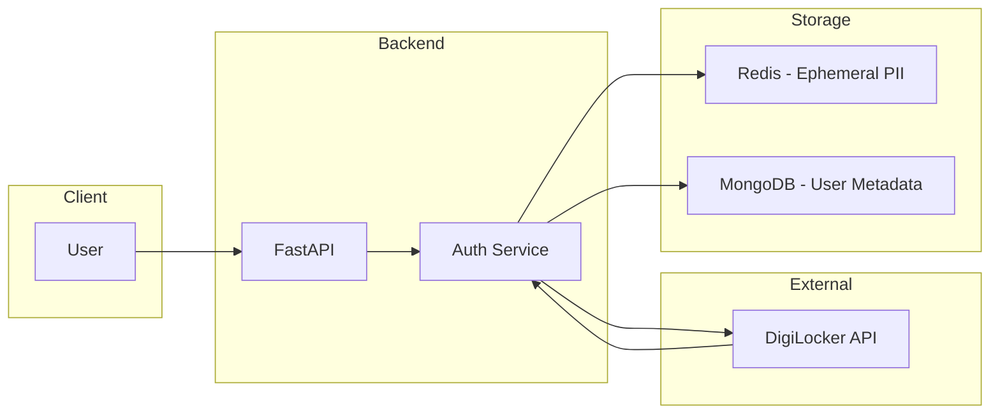
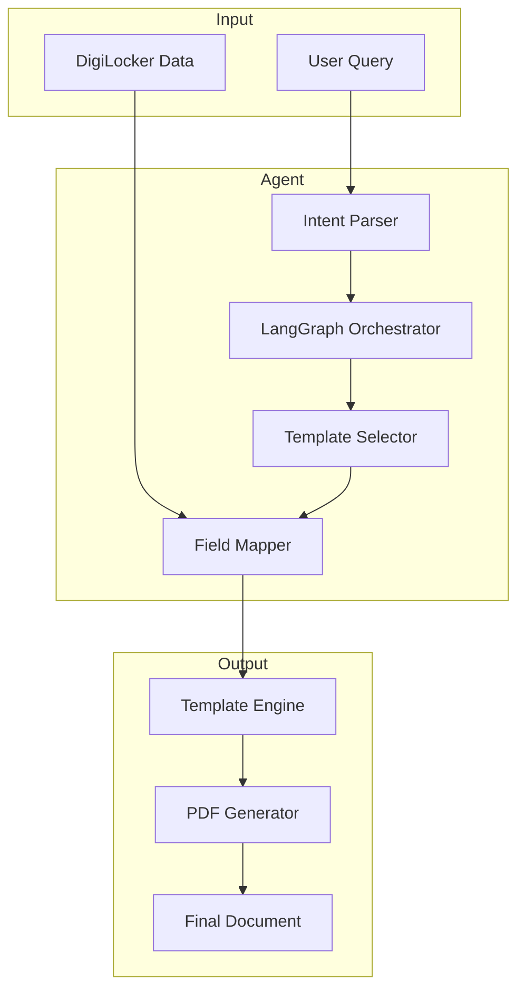
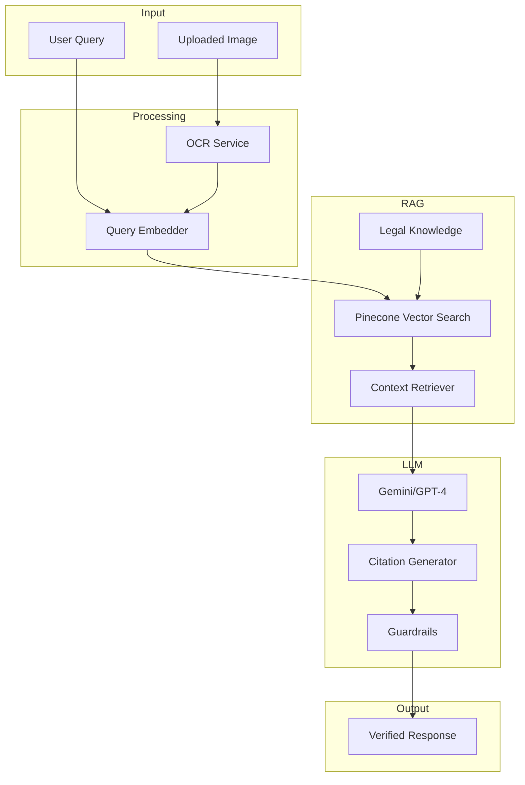
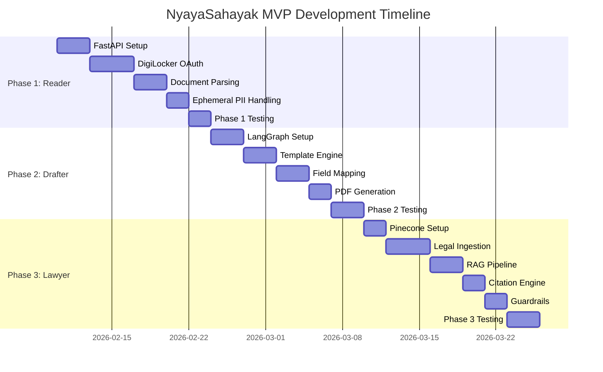

# MVP Roadmap

## Overview

A phased approach to building NyayaSahayak, from foundational infrastructure to a fully-functional Agentic AI Legal Assistant.

---

## Phase 1: The Reader (Week 1-2)

### Objective
Build a module that strictly authenticates with DigiLocker and displays user's verified details in JSON format.

### Deliverables

```
✅ Phase 1 Checklist:
┌────────────────────────────────────────────────────────────────┐
│ [ ] FastAPI project setup with MongoDB & Redis                 │
│ [ ] DigiLocker OAuth 2.0 integration                           │
│     [ ] Authorization flow implementation                      │
│     [ ] Token management (encrypted storage)                   │
│     [ ] Consent management                                     │
│ [ ] Document fetching capabilities                             │
│     [ ] Aadhaar XML parsing                                    │
│     [ ] PAN XML parsing                                        │
│     [ ] Driving License XML parsing                            │
│ [ ] Display verified user details in JSON format               │
│ [ ] Ephemeral PII handling with Redis (5-min TTL)             │
│ [ ] Basic API authentication (JWT)                             │
└────────────────────────────────────────────────────────────────┘
```

### Architecture for Phase 1



### Success Criteria
- ✅ User can link DigiLocker account
- ✅ System fetches Aadhaar/PAN/DL in <5 seconds
- ✅ PII auto-expires from Redis after 5 minutes
- ✅ JSON output displays all verified fields

### Demo Output
```json
{
  "user_verification": {
    "status": "verified",
    "documents": {
      "aadhaar": {
        "name": "Rahul Sharma",
        "masked_number": "XXXX-XXXX-1234",
        "address": "Flat 101, ...",
        "dob": "1995-05-15",
        "verified_at": "2026-02-05T10:30:00Z"
      },
      "pan": {
        "name": "Rahul Sharma",
        "pan_number": "ABCDE1234F",
        "verified_at": "2026-02-05T10:30:00Z"
      }
    }
  }
}
```

---

## Phase 2: The Drafter (Week 3-4)

### Objective
Connect verified document data to legal template generation, starting with Rental Agreements.

### Deliverables

```
✅ Phase 2 Checklist:
┌────────────────────────────────────────────────────────────────┐
│ [ ] LangGraph orchestrator setup                               │
│     [ ] State machine implementation                           │
│     [ ] Checkpointing for conversation recovery                │
│ [ ] Template engine integration                                │
│     [ ] Jinja2 template rendering                              │
│     [ ] Field mapping from DigiLocker → Template               │
│ [ ] Rental Agreement template                                  │
│     [ ] Maharashtra Rent Control Act compliance                │
│     [ ] Karnataka Rent Act compliance                          │
│ [ ] Auto-populate from DigiLocker data                         │
│ [ ] PDF generation service (WeasyPrint/pdfkit)                │
│ [ ] Basic conversation storage (MongoDB)                       │
│ [ ] Affidavit templates (Gap Certificate, Name Change)         │
└────────────────────────────────────────────────────────────────┘
```

### Architecture for Phase 2



### Template Field Mapping

```yaml
Rental Agreement Template:
  Tenant Section:
    full_name: "{{ digilocker.aadhaar.name }}"
    father_name: "{{ digilocker.aadhaar.father_name }}"
    permanent_address: "{{ digilocker.aadhaar.address }}"
    pan_number: "{{ digilocker.pan.number }}"
    dob: "{{ digilocker.aadhaar.dob | format_date }}"
    
  Landlord Section:
    full_name: "{{ user_input.landlord_name }}"
    pan_number: "{{ user_input.landlord_pan }}"
    address: "{{ user_input.landlord_address }}"
    
  Property Section:
    address: "{{ user_input.property_address }}"
    rent_amount: "{{ user_input.rent }}"
    deposit: "{{ user_input.deposit }}"
    period: "{{ user_input.period }}"
    
  Legal Section:
    stamp_duty: "{{ calculate_stamp_duty(rent, period, state) }}"
    applicable_act: "{{ get_rent_act(state) }}"
```

### Success Criteria
- ✅ User describes need → Agent understands intent
- ✅ Relevant documents auto-fetched
- ✅ Template populated with 100% accuracy
- ✅ PDF generated in <3 seconds

---

## Phase 3: The Lawyer (Week 5-6)

### Objective
Add Legal RAG capabilities for answering questions, providing citations, and enabling "on-spot" traffic assistance.

### Deliverables

```
✅ Phase 3 Checklist:
┌────────────────────────────────────────────────────────────────┐
│ [ ] Pinecone vector database setup                             │
│     [ ] Index configuration (1536 dims, cosine)                │
│     [ ] Namespace structure                                    │
│ [ ] Legal document ingestion                                   │
│     [ ] Bharatiya Nyaya Sanhita (BNS) 2023                    │
│     [ ] Motor Vehicles Act 1988 + 2019 Amendment              │
│     [ ] Consumer Protection Act 2019                           │
│     [ ] State Rent Control Acts                                │
│ [ ] RAG pipeline implementation                                │
│     [ ] Query embedding                                        │
│     [ ] Semantic search                                        │
│     [ ] Context retrieval                                      │
│ [ ] Citation generation                                        │
│     [ ] Act + Section + Clause formatting                      │
│     [ ] Confidence scoring                                     │
│ [ ] "On-spot" traffic stop assistance                          │
│     [ ] Quick document display                                 │
│     [ ] Legal backing text generation                          │
│ [ ] Hallucination guardrails                                   │
│     [ ] Low confidence fallback                                │
│     [ ] Human lawyer referral                                  │
│ [ ] OCR integration (Google Vision API)                        │
│     [ ] Challan image parsing                                  │
│     [ ] Cross-reference with DigiLocker                        │
└────────────────────────────────────────────────────────────────┘
```

### Architecture for Phase 3



### Legal RAG Query Example

```python
# User asks: "What is the fine for driving without helmet?"

query = "driving without helmet fine penalty"
query_embedding = embed(query)

# Vector search
results = pinecone.query(
    vector=query_embedding,
    namespace="motor_vehicles_act",
    top_k=3
)

# Results:
# 1. Section 194D: Fine of ₹1000, 3-month license suspension
# 2. Section 129: Compulsory wearing of protective headgear
# 3. BNS Section: Related provisions

# LLM generates response with citations
response = {
    "answer": "The fine for driving without helmet is ₹1,000...",
    "citations": [
        {
            "act": "Motor Vehicles Act, 1988",
            "section": "194D",
            "title": "Penalty for not wearing protective headgear",
            "excerpt": "Whoever drives a two-wheeled motorcycle..."
        }
    ],
    "confidence": 0.95
}
```

### Success Criteria
- ✅ Legal questions answered with specific citations
- ✅ Response latency <10 seconds
- ✅ Confidence-based guardrails working
- ✅ Traffic stop assistance displays in <5 seconds

---

## Timeline Visualization



---

## Resource Requirements

### Team

| Role | Count | Responsibility |
|------|-------|----------------|
| Backend Developer | 2 | FastAPI, LangGraph, Database |
| ML Engineer | 1 | RAG, Embeddings, Guardrails |
| Frontend Developer | 1 | Mobile/Web UI |
| DevOps | 1 | Infrastructure, CI/CD |

### Infrastructure

| Service | Provider | Cost (Monthly) |
|---------|----------|----------------|
| MongoDB Atlas | MongoDB | ~$50 (M10) |
| Pinecone | Pinecone | ~$70 (Starter) |
| Redis Cloud | Redis | ~$30 (Basic) |
| Google Vision API | GCP | ~$20 (usage-based) |
| LLM API | OpenAI/Google | ~$100-200 |
| Hosting | AWS/GCP | ~$100 |
| **Total** | | **~$370-420/month** |

---

## Risk Mitigation

| Risk | Impact | Mitigation |
|------|--------|------------|
| DigiLocker API downtime | High | Graceful degradation, retry logic |
| LLM hallucinations | High | Guardrails, citation requirements |
| PII data breach | Critical | Zero-retention, encryption |
| Legal inaccuracies | High | Human lawyer review for edge cases |
| API rate limits | Medium | Caching, queue management |

---

*Document prepared for hackathon submission - February 2026*
