# System Architecture

## High-Level Architecture

```mermaid
flowchart TB
    subgraph UserLayer["👤 User Layer"]
        WebApp["🌐 Web Application<br/>Next.js/React"]
        MobileApp["📱 Mobile App<br/>React Native"]
        WhatsApp["💬 WhatsApp Bot<br/>(Future)"]
    end

    subgraph APIGateway["🚪 API Gateway"]
        FastAPI["⚡ FastAPI Server"]
        Auth["🔐 Auth Middleware<br/>JWT + OAuth"]
        RateLimiter["🚦 Rate Limiter"]
        CORS["🌍 CORS Handler"]
    end

    subgraph AgenticCore["🧠 Agentic AI Core"]
        Orchestrator["🎭 LangGraph Orchestrator"]
        LLM["🤖 LLM Engine<br/>Gemini / GPT-4"]
        StateManager["📊 State Manager"]
        
        subgraph Tools["🔧 Agent Tools"]
            DigiTool["📄 DigiLocker Tool"]
            LegalTool["⚖️ Legal Search Tool"]
            OCRTool["👁️ OCR Tool"]
            DocGenTool["📝 Doc Generator Tool"]
        end
    end

    subgraph ExternalAPIs["🌐 External Integrations"]
        DigiLocker["🏛️ DigiLocker API<br/>(API Setu)"]
        ESign["✍️ e-Sign API"]
        EStamp["📜 e-Stamp API"]
        VisionAPI["👁️ Google Vision<br/>OCR"]
        EmbeddingAPI["🧬 Embedding API"]
    end

    subgraph DataLayer["💾 Data Layer"]
        MongoDB["🍃 MongoDB Atlas<br/>User Data & Templates"]
        Pinecone["🌲 Pinecone<br/>Legal Vector DB"]
        Redis["⚡ Redis<br/>Ephemeral PII & Cache"]
        S3["📦 S3/Cloud Storage<br/>Generated Documents"]
    end

    WebApp & MobileApp & WhatsApp --> FastAPI
    FastAPI --> Auth --> RateLimiter --> CORS
    CORS --> Orchestrator
    Orchestrator --> LLM
    Orchestrator --> StateManager
    Orchestrator --> Tools
    DigiTool --> DigiLocker
    OCRTool --> VisionAPI
    LegalTool --> Pinecone
    DocGenTool --> S3
    LLM --> EmbeddingAPI
    Tools --> MongoDB
    Tools --> Redis
```



---

## Component Details

### 1. User Layer

| Component | Technology | Purpose |
|-----------|------------|---------|
| Web App | Next.js 14 | Primary user interface |
| Mobile App | React Native | On-the-go access |
| WhatsApp Bot | Twilio | Future: Mass reach |

### 2. API Gateway

```python
# FastAPI Application Structure
from fastapi import FastAPI, Depends
from fastapi.middleware.cors import CORSMiddleware

app = FastAPI(
    title="NyayaSahayak API",
    version="1.0.0",
    docs_url="/docs"
)

# Middleware Stack
app.add_middleware(CORSMiddleware, allow_origins=["*"])
app.add_middleware(RateLimitMiddleware, limit="100/minute")
app.add_middleware(AuthMiddleware)

# Route Registration
app.include_router(auth_router, prefix="/api/v1/auth")
app.include_router(digilocker_router, prefix="/api/v1/digilocker")
app.include_router(agent_router, prefix="/api/v1/agent")
app.include_router(documents_router, prefix="/api/v1/documents")
```

### 3. Agentic AI Core

#### LangGraph Orchestrator

```python
from langgraph.graph import StateGraph, END
from typing import TypedDict, Literal

class AgentState(TypedDict):
    messages: list
    intent: str
    documents_needed: list
    documents_fetched: dict
    legal_context: list
    draft: str
    status: Literal["processing", "awaiting_input", "complete", "error"]

# Define the workflow
workflow = StateGraph(AgentState)

# Add nodes
workflow.add_node("intent_parser", parse_user_intent)
workflow.add_node("doc_fetcher", fetch_digilocker_docs)
workflow.add_node("legal_reasoner", search_legal_context)
workflow.add_node("draft_generator", generate_document)
workflow.add_node("reviewer", present_for_review)

# Define edges
workflow.set_entry_point("intent_parser")
workflow.add_edge("intent_parser", "doc_fetcher")
workflow.add_conditional_edges(
    "doc_fetcher",
    lambda x: "legal_reasoner" if x["documents_fetched"] else "awaiting_input"
)
workflow.add_edge("legal_reasoner", "draft_generator")
workflow.add_edge("draft_generator", "reviewer")
workflow.add_edge("reviewer", END)

# Compile
agent = workflow.compile()
```

#### Agent Tools

```python
from langchain.tools import tool

@tool
def fetch_digilocker_document(doc_type: str, user_id: str) -> dict:
    """Fetch a document from DigiLocker for the user."""
    # Implementation
    pass

@tool
def search_legal_database(query: str, namespace: str = None) -> list:
    """Search the legal knowledge base for relevant sections."""
    # Implementation
    pass

@tool
def generate_legal_document(template_id: str, data: dict) -> str:
    """Generate a legal document from template and data."""
    # Implementation
    pass

@tool
def extract_text_from_image(image_bytes: bytes) -> dict:
    """Extract text and structured data from an image."""
    # Implementation
    pass
```

### 4. External Integrations

#### DigiLocker Integration


#### OCR Pipeline

```python
from google.cloud import vision

async def process_uploaded_document(image_bytes: bytes) -> dict:
    """Process uploaded document image."""
    
    # 1. OCR Extraction
    client = vision.ImageAnnotatorClient()
    image = vision.Image(content=image_bytes)
    response = client.document_text_detection(image=image)
    
    # 2. Entity Extraction
    entities = extract_entities(response.full_text_annotation.text)
    
    # 3. Cross-reference with DigiLocker
    if entities.get("vehicle_number"):
        rc_data = await fetch_digilocker_document("RC", user_id)
        entities["rc_match"] = rc_data["vehicle_number"] == entities["vehicle_number"]
    
    return entities
```

### 5. Data Layer

#### MongoDB Collections

```
┌─────────────────────────────────────────────────────────────┐
│                    MongoDB Atlas                             │
├─────────────────────────────────────────────────────────────┤
│                                                              │
│  users                    document_metadata                  │
│  ├─ _id                   ├─ _id                            │
│  ├─ phone_hash            ├─ user_id                        │
│  ├─ digilocker            ├─ document_type                  │
│  │  ├─ linked             ├─ validity                       │
│  │  └─ consent_valid      └─ last_verified                  │
│  └─ preferences                                              │
│                                                              │
│  agent_conversations      generated_legal_documents          │
│  ├─ _id                   ├─ _id                            │
│  ├─ user_id               ├─ user_id                        │
│  ├─ intent                ├─ template_id                    │
│  ├─ state_machine         ├─ file_url                       │
│  └─ status                └─ status                         │
│                                                              │
│  legal_templates                                             │
│  ├─ _id                                                      │
│  ├─ template_name                                            │
│  ├─ applicable_states                                        │
│  └─ template_content                                         │
│                                                              │
└─────────────────────────────────────────────────────────────┘
```

#### Pinecone Vector Index

```yaml
Index: nyayasahayak-legal
Metric: cosine
Dimension: 1536

Namespaces:
  bns_2023:           # Bharatiya Nyaya Sanhita
    vectors: ~1000
    metadata: [act, section, title, keywords, effective_date]
    
  motor_vehicles_act: # MVA + Amendments
    vectors: ~500
    metadata: [act, section, title, keywords, penalty_amount]
    
  consumer_protection: # CPA 2019
    vectors: ~300
    metadata: [act, section, title, keywords]
    
  rent_control_acts:  # State-wise
    vectors: ~400
    metadata: [act, section, title, state, keywords]
```

#### Redis Key Schema

| Key Pattern | Purpose | TTL |
|-------------|---------|-----|
| `session:{id}` | User session | 24h |
| `pii:{user_id}:{req_id}` | Ephemeral PII | 5 min |
| `tokens:{user_id}` | DigiLocker tokens | 1h |
| `rate:{user_id}` | Rate limit counter | 1 min |
| `cache:legal:{hash}` | Legal search cache | 24h |
| `agent:{conv_id}` | Agent state checkpoint | 1h |

---

## Security Architecture

### Zero-Trust PII Handling

```
┌─────────────────────────────────────────────────────────────┐
│                    PII DATA FLOW                             │
├─────────────────────────────────────────────────────────────┤
│                                                              │
│  DigiLocker ─────► Redis (Encrypted) ─────► Processing      │
│      │                   │                      │           │
│      │                   │ 5 min TTL           │           │
│      │                   ▼                      │           │
│      │              Auto-Delete                 │           │
│      │                                          │           │
│      └──────────── NEVER ───────────────────────┘           │
│                      │                                       │
│                      ▼                                       │
│              MongoDB / Logs                                  │
│                                                              │
└─────────────────────────────────────────────────────────────┘
```

### Encryption Standards

| Data | At Rest | In Transit |
|------|---------|------------|
| DigiLocker Tokens | AES-256-GCM | TLS 1.3 |
| PII (Redis) | AES-256-GCM | TLS 1.3 |
| Generated Docs | AES-256-GCM | TLS 1.3 |
| API Keys | HashiCorp Vault | TLS 1.3 |

---

## Scalability Design

### Horizontal Scaling


### Performance Targets

| Metric | Target | Strategy |
|--------|--------|----------|
| API Latency (p99) | <500ms | Async processing |
| Agent Response | <10s | Streaming, caching |
| Document Generation | <3s | Pre-compiled templates |
| Concurrent Users | 1000 | Horizontal scaling |

---

*Document prepared for hackathon submission - February 2026*
