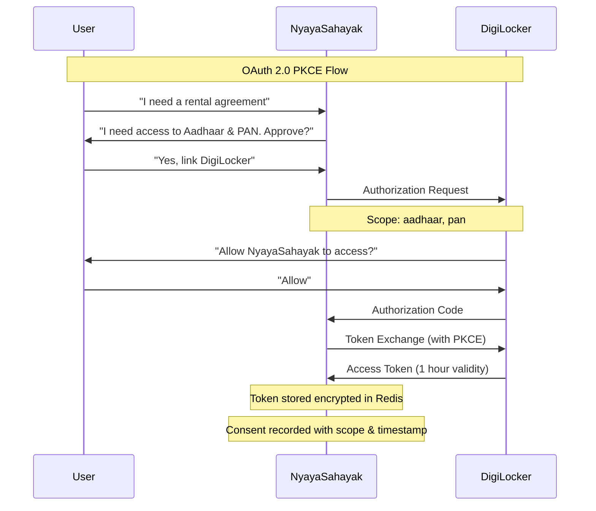
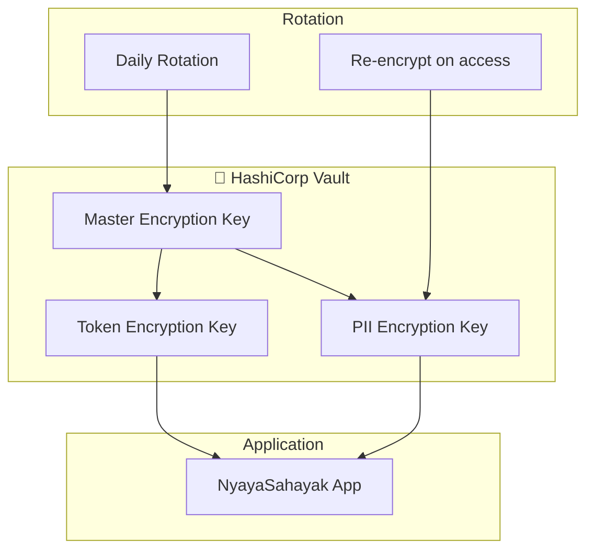

# Privacy & Security Design

## Executive Summary

NyayaSahayak handles sensitive personal data from DigiLocker. Our security architecture is built on the principle of **Zero-Retention Privacy**—PII is processed in ephemeral memory and never persisted to databases or logs.

---

## Core Principles

### 1. Zero-Retention Privacy

> **PII from DigiLocker is processed in RAM only and auto-deleted within 5 minutes.**

```
┌─────────────────────────────────────────────────────────────┐
│                  ZERO-RETENTION ARCHITECTURE                 │
├─────────────────────────────────────────────────────────────┤
│                                                              │
│  ┌──────────┐     ┌──────────┐     ┌──────────┐            │
│  │DigiLocker│ ──► │  Redis   │ ──► │ Process  │            │
│  │   API    │     │ (5 min)  │     │ in RAM   │            │
│  └──────────┘     └──────────┘     └──────────┘            │
│                         │                │                  │
│                         │                │                  │
│                         ▼                ▼                  │
│                   ┌──────────┐    ┌──────────┐             │
│                   │Auto-Del  │    │PDF Output│             │
│                   │(TTL exp) │    │(to user) │             │
│                   └──────────┘    └──────────┘             │
│                                                              │
│  ❌ NEVER persisted to:                                     │
│     • MongoDB                                                │
│     • Application logs                                       │
│     • Monitoring systems                                     │
│     • Error tracking (Sentry)                               │
│                                                              │
└─────────────────────────────────────────────────────────────┘
```

---

### 2. Data Classification

| Classification | Examples | Storage | Logging | Retention |
|---------------|----------|---------|---------|-----------|
| 🔴 **RED (PII)** | Aadhaar #, Name, Address, DOB, Photo | Redis ONLY | NEVER | 5 min max |
| 🟡 **YELLOW (Sensitive)** | Phone hash, Email hash, Document URIs | MongoDB (encrypted) | Sanitized | 30 days |
| 🟢 **GREEN (General)** | Intent, Status, Timestamps, Template IDs | MongoDB | Full | 1 year |

---

### 3. Consent-Based Access



---

## Implementation Details

### Ephemeral PII Store

```python
from cryptography.fernet import Fernet
import redis
import json

class EphemeralPIIStore:
    """
    Secure ephemeral storage for PII data.
    All data is encrypted and auto-expires.
    """
    
    PII_TTL = 300  # 5 minutes - NEVER increase
    
    def __init__(self, redis_client: redis.Redis, encryption_key: bytes):
        self.redis = redis_client
        self.cipher = Fernet(encryption_key)
    
    async def store_pii(
        self, 
        user_id: str, 
        request_id: str, 
        data: dict,
        purpose: str
    ) -> None:
        """Store PII with encryption and mandatory TTL."""
        
        key = f"pii:{user_id}:{request_id}"
        
        # Add metadata
        payload = {
            "data": data,
            "purpose": purpose,
            "stored_at": datetime.utcnow().isoformat(),
            "consent_reference": request_id
        }
        
        # Encrypt
        encrypted = self.cipher.encrypt(json.dumps(payload).encode())
        
        # Store with mandatory TTL
        await self.redis.setex(key, self.PII_TTL, encrypted)
        
        # Log access (without PII)
        self._audit_log("PII_STORED", user_id, request_id, purpose)
    
    async def get_pii(self, user_id: str, request_id: str) -> dict | None:
        """Retrieve PII. Returns None if expired or not found."""
        
        key = f"pii:{user_id}:{request_id}"
        encrypted = await self.redis.get(key)
        
        if not encrypted:
            return None
        
        decrypted = self.cipher.decrypt(encrypted)
        payload = json.loads(decrypted.decode())
        
        self._audit_log("PII_ACCESSED", user_id, request_id)
        
        return payload["data"]
    
    async def delete_pii(self, user_id: str, request_id: str) -> None:
        """Explicitly delete PII before TTL expiry."""
        
        key = f"pii:{user_id}:{request_id}"
        await self.redis.delete(key)
        
        self._audit_log("PII_DELETED", user_id, request_id)
    
    def _audit_log(self, action: str, user_id: str, request_id: str, purpose: str = None):
        """Log PII access without logging actual PII."""
        logger.info({
            "action": action,
            "user_id_hash": hashlib.sha256(user_id.encode()).hexdigest()[:16],
            "request_id": request_id,
            "purpose": purpose,
            "timestamp": datetime.utcnow().isoformat()
        })
```

---

### Secure Logging

```python
import logging
import re

class PIIRedactingFilter(logging.Filter):
    """Filter that redacts PII patterns from log messages."""
    
    PII_PATTERNS = [
        (r'\d{4}\s?\d{4}\s?\d{4}', '[AADHAAR_REDACTED]'),  # Aadhaar
        (r'[A-Z]{5}\d{4}[A-Z]', '[PAN_REDACTED]'),          # PAN
        (r'\+91\d{10}', '[PHONE_REDACTED]'),                # Phone
        (r'[a-zA-Z0-9_.+-]+@[a-zA-Z0-9-]+\.[a-zA-Z0-9-.]+', '[EMAIL_REDACTED]'),
    ]
    
    def filter(self, record):
        message = record.getMessage()
        
        for pattern, replacement in self.PII_PATTERNS:
            message = re.sub(pattern, replacement, message)
        
        record.msg = message
        record.args = ()
        
        return True

# Apply to all loggers
logging.getLogger().addFilter(PIIRedactingFilter())
```

---

### Secure DigiLocker Token Storage

```python
class SecureTokenStore:
    """Encrypted storage for DigiLocker OAuth tokens."""
    
    TOKEN_TTL = 3600  # 1 hour
    
    async def store_tokens(self, user_id: str, tokens: dict) -> None:
        """Store OAuth tokens securely."""
        
        key = f"tokens:{user_id}"
        
        encrypted = self.cipher.encrypt(json.dumps({
            "access_token": tokens["access_token"],
            "refresh_token": tokens["refresh_token"],
            "expires_at": tokens["expires_at"],
            "scope": tokens["scope"]
        }).encode())
        
        await self.redis.setex(key, self.TOKEN_TTL, encrypted)
    
    async def get_tokens(self, user_id: str) -> dict | None:
        """Retrieve tokens. Automatically refresh if expired."""
        
        key = f"tokens:{user_id}"
        encrypted = await self.redis.get(key)
        
        if not encrypted:
            return None
        
        tokens = json.loads(self.cipher.decrypt(encrypted).decode())
        
        # Check if access token expired
        if datetime.fromisoformat(tokens["expires_at"]) < datetime.utcnow():
            tokens = await self._refresh_tokens(tokens["refresh_token"])
            await self.store_tokens(user_id, tokens)
        
        return tokens
```

---

## DPDPA 2023 Compliance

### Digital Personal Data Protection Act Mapping

| DPDPA Requirement | NyayaSahayak Implementation |
|-------------------|----------------------------|
| **Purpose Limitation** | Documents fetched only for stated purpose (rental, affidavit, etc.) |
| **Data Minimization** | Only required fields extracted from XML |
| **Storage Limitation** | 5-minute TTL, no persistence |
| **Consent** | Explicit DigiLocker OAuth consent with scope |
| **Right to Erasure** | Auto-delete via TTL + manual delete option |
| **Data Portability** | Not applicable (we don't store data) |
| **Security Safeguards** | AES-256 encryption, TLS 1.3, access controls |
| **Breach Notification** | Incident response plan with 72-hour notification |

---

## Encryption Standards

### Algorithms Used

| Purpose | Algorithm | Key Size | Notes |
|---------|-----------|----------|-------|
| PII at rest (Redis) | AES-256-GCM | 256-bit | Authenticated encryption |
| Tokens at rest | AES-256-GCM | 256-bit | Automatic rotation |
| Data in transit | TLS 1.3 | N/A | Forward secrecy |
| Password hashing | Argon2id | N/A | Memory-hard |
| Document signing | RSA-SHA256 | 2048-bit | For e-Sign integration |

### Key Management



---

## Access Controls

### API Authentication

```python
from fastapi import Depends, HTTPException
from fastapi.security import OAuth2PasswordBearer

oauth2_scheme = OAuth2PasswordBearer(tokenUrl="token")

async def get_current_user(token: str = Depends(oauth2_scheme)):
    """Validate JWT and extract user."""
    
    try:
        payload = jwt.decode(
            token, 
            settings.JWT_SECRET, 
            algorithms=["HS256"]
        )
        user_id = payload.get("sub")
        
        if not user_id:
            raise HTTPException(status_code=401)
        
        return await get_user(user_id)
        
    except jwt.ExpiredSignatureError:
        raise HTTPException(status_code=401, detail="Token expired")
    except jwt.JWTError:
        raise HTTPException(status_code=401, detail="Invalid token")
```

### Role-Based Access

| Role | Permissions |
|------|-------------|
| `user` | Own documents, own conversations |
| `agent` | Tool execution, ephemeral PII access |
| `admin` | User management (no PII access) |
| `auditor` | Audit logs only |

---

## Incident Response

### Breach Response Plan

```
┌─────────────────────────────────────────────────────────────┐
│                    INCIDENT RESPONSE                         │
├─────────────────────────────────────────────────────────────┤
│                                                              │
│  Detection ───► Containment ───► Investigation              │
│      │              │                  │                    │
│      │              │                  │                    │
│      ▼              ▼                  ▼                    │
│  • Monitoring   • Revoke tokens    • Audit logs             │
│  • Alerts       • Rotate keys      • Forensics              │
│  • User report  • Block access     • Root cause             │
│                                                              │
│  Notification ───► Remediation ───► Post-Incident           │
│      │                 │                  │                 │
│      │                 │                  │                 │
│      ▼                 ▼                  ▼                 │
│  • DPDPA 72hr     • Patch vuln      • Update docs          │
│  • User notify    • Re-encrypt      • Training              │
│  • Regulator      • Security audit  • Improve               │
│                                                              │
└─────────────────────────────────────────────────────────────┘
```

---

## Security Checklist

```
✅ Security Implementation Checklist
┌────────────────────────────────────────────────────────────┐
│ [x] All PII stored in Redis with 5-min TTL only           │
│ [x] AES-256-GCM encryption for all sensitive data         │
│ [x] TLS 1.3 for all API communications                    │
│ [x] OAuth 2.0 PKCE for DigiLocker integration             │
│ [x] JWT with short expiry (1 hour) for auth               │
│ [x] PII-redacting log filter enabled                      │
│ [x] Argon2id for any password hashing                     │
│ [x] Input validation on all endpoints                     │
│ [x] Rate limiting per user                                │
│ [x] CORS properly configured                              │
│ [x] Security headers (HSTS, CSP, etc.)                    │
│ [x] Regular security audits scheduled                     │
│ [x] Incident response plan documented                     │
│ [x] DPDPA compliance verified                             │
└────────────────────────────────────────────────────────────┘
```

---

*Document prepared for hackathon submission - February 2026*
