# DigiLocker Integration

## Overview

DigiLocker is a flagship initiative of the Government of India under the Digital India program. It provides citizens with a digital platform to store and share authenticated electronic documents.

NyayaSahayak uses the **DigiLocker API (via API Setu)** to fetch verified documents directly from government sources.

---

## Why DigiLocker?

### Benefits for NyayaSahayak

| Benefit | Description |
|---------|-------------|
| **Verified Data** | Documents are issued by government departments |
| **No Manual Upload** | Agent fetches data autonomously |
| **Machine Readable** | XML/JSON format, not just PDF |
| **Legal Validity** | IT Act recognizes DigiLocker documents as originals |
| **User Trust** | Government-backed platform |

### Supported Documents

| Document | Issuer | Key Fields |
|----------|--------|------------|
| Aadhaar | UIDAI | Name, Address, DOB, Photo, UID (masked) |
| PAN Card | Income Tax Dept | Name, PAN Number, DOB |
| Driving License | State Transport | Name, DL Number, Validity, Vehicle Classes |
| Vehicle RC | State Transport | Owner, Vehicle Number, Make/Model, Insurance |
| Insurance Certificate | Insurance Companies | Policy No, Validity, Coverage |
| Class X Marksheet | Education Boards | Name, School, Year, Marks |
| Class XII Marksheet | Education Boards | Name, School, Year, Marks |

---

## Integration Architecture

```mermaid
sequenceDiagram
    participant U as User
    participant App as NyayaSahayak
    participant Auth as Auth Server
    participant DL as DigiLocker API
    participant R as Redis

    rect rgb(230, 245, 255)
        Note over U,R: Phase 1: Authorization
        U->>App: "Link DigiLocker"
        App->>App: Generate code_verifier + code_challenge (PKCE)
        App->>App: Generate state parameter
        App->>R: Store state + code_verifier (10 min TTL)
        App->>U: Redirect to DigiLocker Auth URL
        U->>DL: Login with DigiLocker credentials
        DL->>U: Show consent screen
        U->>DL: Grant consent
        DL->>App: Callback with authorization_code + state
        App->>R: Verify state
        App->>DL: Exchange code for tokens (with code_verifier)
        DL->>App: access_token + refresh_token
        App->>R: Store encrypted tokens (1 hr TTL)
        App->>U: "DigiLocker linked successfully!"
    end

    rect rgb(255, 245, 230)
        Note over U,R: Phase 2: Document Fetch
        U->>App: "I need a rental agreement"
        App->>App: Determine required docs: [Aadhaar, PAN]
        App->>R: Get access_token
        App->>DL: GET /pull/aadhaar
        DL->>App: Aadhaar XML
        App->>DL: GET /pull/pan
        DL->>App: PAN XML
        App->>R: Store PII (5 min TTL)
        App->>App: Process documents
        App->>R: Delete PII
        App->>U: "Documents verified ✓"
    end
```



---

## OAuth 2.0 Implementation

### Authorization URL Construction

```python
import secrets
import hashlib
import base64
from urllib.parse import urlencode

class DigiLockerAuth:
    AUTH_URL = "https://digilocker.meripehchaan.gov.in/public/oauth2/1/authorize"
    TOKEN_URL = "https://digilocker.meripehchaan.gov.in/public/oauth2/1/token"
    
    def __init__(self, client_id: str, client_secret: str, redirect_uri: str):
        self.client_id = client_id
        self.client_secret = client_secret
        self.redirect_uri = redirect_uri
    
    def generate_auth_url(self, scope: list[str]) -> tuple[str, str, str]:
        """Generate DigiLocker authorization URL with PKCE."""
        
        # Generate random state
        state = secrets.token_urlsafe(32)
        
        # Generate PKCE code verifier and challenge
        code_verifier = secrets.token_urlsafe(64)
        code_challenge = base64.urlsafe_b64encode(
            hashlib.sha256(code_verifier.encode()).digest()
        ).decode().rstrip("=")
        
        # Build authorization URL
        params = {
            "response_type": "code",
            "client_id": self.client_id,
            "redirect_uri": self.redirect_uri,
            "state": state,
            "scope": " ".join(scope),
            "code_challenge": code_challenge,
            "code_challenge_method": "S256"
        }
        
        auth_url = f"{self.AUTH_URL}?{urlencode(params)}"
        
        return auth_url, state, code_verifier
```

### Token Exchange

```python
import httpx

async def exchange_code_for_tokens(
    self, 
    authorization_code: str, 
    code_verifier: str
) -> dict:
    """Exchange authorization code for access tokens."""
    
    async with httpx.AsyncClient() as client:
        response = await client.post(
            self.TOKEN_URL,
            data={
                "grant_type": "authorization_code",
                "code": authorization_code,
                "redirect_uri": self.redirect_uri,
                "client_id": self.client_id,
                "client_secret": self.client_secret,
                "code_verifier": code_verifier
            }
        )
        
        if response.status_code != 200:
            raise DigiLockerAuthError(response.json())
        
        tokens = response.json()
        
        return {
            "access_token": tokens["access_token"],
            "refresh_token": tokens.get("refresh_token"),
            "expires_at": datetime.utcnow() + timedelta(seconds=tokens["expires_in"]),
            "scope": tokens.get("scope", "").split()
        }
```

---

## Document Fetching

### API Endpoints

| Document | Endpoint | Scope |
|----------|----------|-------|
| Aadhaar | `GET /public/oauth2/1/pull/aadhaar` | `resident` |
| PAN | `GET /public/oauth2/1/pull/pan` | `pan` |
| Driving License | `GET /public/oauth2/1/pull/dl` | `dl` |
| Vehicle RC | `GET /public/oauth2/1/pull/rc` | `rc` |
| Insurance | `GET /public/oauth2/1/pull/vahan/insurance` | `vahan` |

### Document Fetch Implementation

```python
class DigiLockerClient:
    BASE_URL = "https://digilocker.meripehchaan.gov.in/public/oauth2/1"
    
    async def fetch_document(
        self, 
        access_token: str, 
        doc_type: str
    ) -> dict:
        """Fetch document from DigiLocker."""
        
        endpoint_map = {
            "AADHAAR": "/pull/aadhaar",
            "PAN": "/pull/pan",
            "DL": "/pull/dl",
            "RC": "/pull/rc",
            "INSURANCE": "/pull/vahan/insurance"
        }
        
        endpoint = endpoint_map.get(doc_type)
        if not endpoint:
            raise ValueError(f"Unsupported document type: {doc_type}")
        
        async with httpx.AsyncClient() as client:
            response = await client.get(
                f"{self.BASE_URL}{endpoint}",
                headers={
                    "Authorization": f"Bearer {access_token}",
                    "Accept": "application/xml"  # Request XML for parsing
                }
            )
            
            if response.status_code != 200:
                raise DigiLockerError(response.text)
            
            # Parse XML response
            return self._parse_document_xml(doc_type, response.text)
    
    def _parse_document_xml(self, doc_type: str, xml_content: str) -> dict:
        """Parse DigiLocker XML response to structured dict."""
        
        import xml.etree.ElementTree as ET
        root = ET.fromstring(xml_content)
        
        if doc_type == "AADHAAR":
            return {
                "name": root.find(".//name").text,
                "dob": root.find(".//dob").text,
                "gender": root.find(".//gender").text,
                "address": {
                    "house": root.find(".//house").text,
                    "street": root.find(".//street").text,
                    "locality": root.find(".//loc").text,
                    "district": root.find(".//dist").text,
                    "state": root.find(".//state").text,
                    "pincode": root.find(".//pc").text
                },
                "masked_uid": root.find(".//uid").text  # Last 4 digits visible
            }
        
        # Similar parsing for other document types...
```

---

## Scopes and Consent

### Available Scopes

| Scope | Description | Documents Accessible |
|-------|-------------|---------------------|
| `resident` | Resident services | Aadhaar |
| `pan` | PAN verification | PAN Card |
| `dl` | Driving License | DL, DL Address |
| `rc` | Vehicle Registration | RC, RC Address |
| `vahan` | Vehicle services | Insurance, Pollution |
| `education` | Education documents | Marksheets, Certificates |

### Requesting Minimal Scopes

```python
def get_required_scopes(intent: str) -> list[str]:
    """Return minimal required scopes for user intent."""
    
    scope_map = {
        "rental_agreement": ["resident", "pan"],
        "affidavit_gap": ["resident", "education"],
        "traffic_document": ["dl", "rc", "vahan"],
        "vehicle_insurance": ["rc", "vahan"],
        "name_change": ["resident"],
    }
    
    return scope_map.get(intent, ["resident"])
```

---

## Error Handling

### Common Errors

| Error Code | Meaning | Action |
|------------|---------|--------|
| `invalid_token` | Token expired or revoked | Refresh or re-authorize |
| `insufficient_scope` | Missing required scope | Request additional consent |
| `document_not_found` | Document not in DigiLocker | Ask user to add document |
| `consent_revoked` | User revoked consent | Re-authorize |
| `rate_limited` | Too many requests | Implement backoff |

### Error Handler

```python
class DigiLockerError(Exception):
    def __init__(self, error_code: str, message: str):
        self.error_code = error_code
        self.message = message

async def handle_digilocker_error(error: DigiLockerError) -> dict:
    """Handle DigiLocker API errors gracefully."""
    
    error_responses = {
        "invalid_token": {
            "action": "re_authorize",
            "user_message": "Your DigiLocker session has expired. Please re-link your account."
        },
        "insufficient_scope": {
            "action": "request_scope",
            "user_message": "We need additional permissions to access this document."
        },
        "document_not_found": {
            "action": "inform_user",
            "user_message": "This document is not available in your DigiLocker. Please add it first."
        }
    }
    
    return error_responses.get(error.error_code, {
        "action": "contact_support",
        "user_message": "An error occurred. Please try again or contact support."
    })
```

---

## Testing with DigiLocker Sandbox

### Sandbox Environment

```python
class DigiLockerConfig:
    # Production
    PROD_AUTH_URL = "https://digilocker.meripehchaan.gov.in/public/oauth2/1/authorize"
    PROD_API_URL = "https://digilocker.meripehchaan.gov.in/public/oauth2/1"
    
    # Sandbox (for testing)
    SANDBOX_AUTH_URL = "https://dgsandbox.digitallocker.gov.in/public/oauth2/1/authorize"
    SANDBOX_API_URL = "https://dgsandbox.digitallocker.gov.in/public/oauth2/1"
    
    @classmethod
    def get_urls(cls, environment: str = "sandbox"):
        if environment == "production":
            return cls.PROD_AUTH_URL, cls.PROD_API_URL
        return cls.SANDBOX_AUTH_URL, cls.SANDBOX_API_URL
```

### Test Credentials

```yaml
# Sandbox test user (provided by DigiLocker)
test_user:
  phone: "9999999999"
  otp: "123456"
  
# Available test documents
test_documents:
  - aadhaar: "XXXX-XXXX-1234"
  - pan: "TESTPAN123"
  - dl: "DL-1234567890"
```

---

## Legal Validity

### IT Act References

> **Rule 9A of the Information Technology Rules, 2011:**
> 
> "Any document available on DigiLocker shall be deemed to be legally equivalent to the original document and shall be valid for all purposes."

### Display Text for Officers

When showing documents to authorities:

```
┌─────────────────────────────────────────────────────────────┐
│ 🏛️ GOVERNMENT OF INDIA - DIGILOCKER                        │
├─────────────────────────────────────────────────────────────┤
│                                                              │
│ This is an officially issued document from DigiLocker,      │
│ a Government of India initiative.                           │
│                                                              │
│ Under Rule 9A of the IT (Reasonable Security Practices      │
│ and Procedures and Sensitive Personal Data or Information)  │
│ Rules, 2011, this document is legally equivalent to the     │
│ original physical document.                                  │
│                                                              │
│ Verify at: https://digilocker.gov.in                        │
│                                                              │
└─────────────────────────────────────────────────────────────┘
```

---

*Document prepared for hackathon submission - February 2026*
