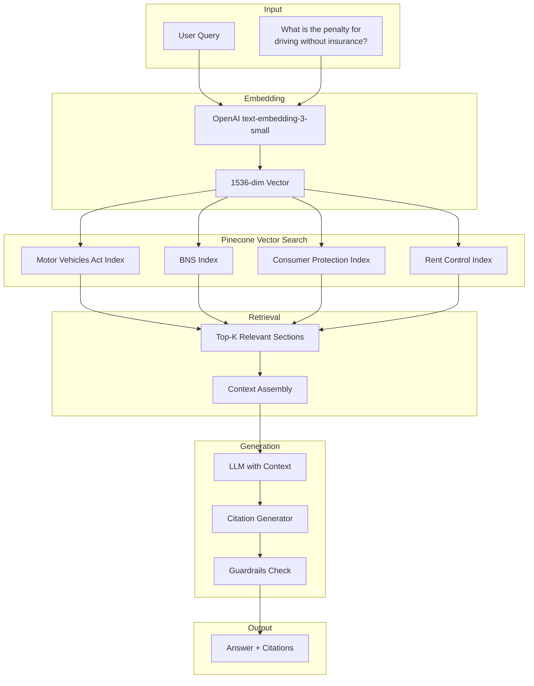

# Legal RAG System

## Overview

The Legal RAG (Retrieval Augmented Generation) system is the "brain" of NyayaSahayak, enabling it to answer legal questions with accurate citations from Indian law.

---

## Architecture



---

## Legal Knowledge Base

### Indexed Laws

| Law | Sections | Indexed | Priority |
|-----|----------|---------|----------|
| **Bharatiya Nyaya Sanhita (BNS) 2023** | 358 | ⏳ Phase 3 | High |
| **Motor Vehicles Act, 1988** | 223 + Amendments | ⏳ Phase 3 | High |
| **Consumer Protection Act, 2019** | 107 | ⏳ Phase 3 | Medium |
| **Information Technology Act, 2000** | 90 | ⏳ Phase 3 | Medium |
| **Maharashtra Rent Control Act** | 55 | ⏳ Phase 3 | High |
| **Karnataka Rent Act, 2001** | 42 | ⏳ Phase 3 | High |
| **Delhi Rent Control Act** | 50 | ⏳ Phase 3 | Medium |

### Vector Index Configuration

```python
# Pinecone Index Setup
import pinecone

pinecone.init(api_key=os.getenv("PINECONE_API_KEY"))

# Create index
pinecone.create_index(
    name="nyayasahayak-legal",
    dimension=1536,  # text-embedding-3-small
    metric="cosine",
    spec=pinecone.ServerlessSpec(
        cloud="aws",
        region="us-east-1"
    )
)

index = pinecone.Index("nyayasahayak-legal")
```

---

## Ingestion Pipeline

### Step 1: Document Preparation

```python
from dataclasses import dataclass
from typing import List

@dataclass
class LegalSection:
    act_name: str
    section_number: str
    title: str
    content: str
    keywords: List[str]
    effective_date: str
    state: str  # "central" or state name
    amendments: List[dict]

# Example: Motor Vehicles Act
sections = [
    LegalSection(
        act_name="Motor Vehicles Act, 1988",
        section_number="196",
        title="Penalty for driving uninsured vehicle",
        content="""
        Whoever drives a motor vehicle or causes or allows a motor vehicle to be
        driven in contravention of the provisions of section 146 shall be
        punishable with imprisonment which may extend to three months, or with
        fine which may extend to two thousand rupees, or with both.
        
        Provided that if the person is a first-time offender, the fine shall
        not be less than one thousand rupees.
        """,
        keywords=["insurance", "uninsured", "penalty", "fine", "section 146"],
        effective_date="2019-09-01",
        state="central",
        amendments=[{
            "act": "Motor Vehicles (Amendment) Act, 2019",
            "change": "Fine increased from ₹1000 to ₹2000"
        }]
    )
]
```

### Step 2: Chunking Strategy

```python
from langchain.text_splitter import RecursiveCharacterTextSplitter

def chunk_legal_section(section: LegalSection) -> List[dict]:
    """Chunk legal section for embedding."""
    
    splitter = RecursiveCharacterTextSplitter(
        chunk_size=500,
        chunk_overlap=50,
        separators=["\n\n", "\n", ". ", " "]
    )
    
    # Prepend context for better retrieval
    full_text = f"""
    Act: {section.act_name}
    Section: {section.section_number}
    Title: {section.title}
    
    {section.content}
    """
    
    chunks = splitter.split_text(full_text)
    
    return [{
        "text": chunk,
        "metadata": {
            "act": section.act_name,
            "section": section.section_number,
            "title": section.title,
            "keywords": section.keywords,
            "effective_date": section.effective_date,
            "state": section.state,
            "chunk_index": i,
            "total_chunks": len(chunks)
        }
    } for i, chunk in enumerate(chunks)]
```

### Step 3: Embedding & Upsert

```python
from openai import OpenAI

client = OpenAI()

async def embed_and_upsert(sections: List[LegalSection], namespace: str):
    """Embed legal sections and upsert to Pinecone."""
    
    for section in sections:
        chunks = chunk_legal_section(section)
        
        for chunk in chunks:
            # Generate embedding
            response = client.embeddings.create(
                model="text-embedding-3-small",
                input=chunk["text"]
            )
            embedding = response.data[0].embedding
            
            # Upsert to Pinecone
            vector_id = f"{section.act_name}_{section.section_number}_{chunk['metadata']['chunk_index']}"
            
            index.upsert(
                vectors=[{
                    "id": vector_id,
                    "values": embedding,
                    "metadata": chunk["metadata"]
                }],
                namespace=namespace
            )
```

---

## Retrieval Pipeline

### Query Processing

```python
async def search_legal_knowledge(
    query: str,
    namespaces: List[str] = None,
    top_k: int = 5,
    filter_state: str = None
) -> List[dict]:
    """Search legal knowledge base for relevant sections."""
    
    # Default to all namespaces
    if namespaces is None:
        namespaces = [
            "motor_vehicles_act",
            "bns_2023",
            "consumer_protection",
            "rent_control"
        ]
    
    # Embed query
    response = client.embeddings.create(
        model="text-embedding-3-small",
        input=query
    )
    query_embedding = response.data[0].embedding
    
    all_results = []
    
    for namespace in namespaces:
        # Build filter
        filter_dict = {}
        if filter_state:
            filter_dict["state"] = {"$in": ["central", filter_state]}
        
        # Query Pinecone
        results = index.query(
            vector=query_embedding,
            namespace=namespace,
            top_k=top_k,
            include_metadata=True,
            filter=filter_dict if filter_dict else None
        )
        
        all_results.extend([
            {
                "score": match.score,
                "act": match.metadata["act"],
                "section": match.metadata["section"],
                "title": match.metadata["title"],
                "content": match.metadata.get("text", ""),
                "namespace": namespace
            }
            for match in results.matches
        ])
    
    # Sort by score and deduplicate
    all_results.sort(key=lambda x: x["score"], reverse=True)
    
    return all_results[:top_k]
```

---

## Citation Generation

### Citation Format

```python
@dataclass
class LegalCitation:
    act: str
    section: str
    title: str
    excerpt: str
    relevance_score: float
    
    def format_for_display(self) -> str:
        return f"""
        📜 **{self.act}**
        Section {self.section}: {self.title}
        
        > "{self.excerpt}"
        
        Relevance: {self.relevance_score:.0%}
        """
    
    def format_for_officer(self) -> str:
        """Format citation for showing to authority."""
        return f"Under {self.act}, Section {self.section} ({self.title})"
```

### Response with Citations

```python
async def generate_legal_response(
    query: str,
    user_context: dict = None
) -> dict:
    """Generate legal response with citations."""
    
    # 1. Search relevant sections
    relevant_sections = await search_legal_knowledge(
        query=query,
        filter_state=user_context.get("state") if user_context else None
    )
    
    # 2. Build context for LLM
    context = "\n\n".join([
        f"Source: {s['act']}, Section {s['section']}\n{s['content']}"
        for s in relevant_sections
    ])
    
    # 3. Generate response
    response = await llm.generate(
        system_prompt=LEGAL_SYSTEM_PROMPT,
        user_message=query,
        context=context
    )
    
    # 4. Extract citations
    citations = [
        LegalCitation(
            act=s["act"],
            section=s["section"],
            title=s["title"],
            excerpt=s["content"][:200],
            relevance_score=s["score"]
        )
        for s in relevant_sections[:3]
    ]
    
    # 5. Apply guardrails
    validated_response = await apply_guardrails(response, citations)
    
    return {
        "answer": validated_response["answer"],
        "citations": citations,
        "confidence": validated_response["confidence"],
        "disclaimer": validated_response.get("disclaimer")
    }
```

---

## Guardrails

### Hallucination Prevention

```python
class LegalGuardrails:
    CONFIDENCE_THRESHOLD = 0.75
    MIN_CITATIONS = 1
    
    async def validate_response(
        self,
        response: str,
        citations: List[LegalCitation]
    ) -> dict:
        """Validate legal response for accuracy."""
        
        # Check 1: Must have citations
        if len(citations) < self.MIN_CITATIONS:
            return {
                "valid": False,
                "answer": response,
                "confidence": 0.0,
                "disclaimer": "⚠️ Unable to find specific legal references. Please consult a lawyer."
            }
        
        # Check 2: Citation relevance threshold
        avg_relevance = sum(c.relevance_score for c in citations) / len(citations)
        
        if avg_relevance < self.CONFIDENCE_THRESHOLD:
            return {
                "valid": True,
                "answer": response,
                "confidence": avg_relevance,
                "disclaimer": "ℹ️ This information is provided for general guidance. For your specific situation, please consult a qualified legal professional."
            }
        
        # Check 3: Detect absolute statements
        absolute_phrases = [
            "you will definitely",
            "100% guaranteed",
            "always",
            "never",
            "impossible"
        ]
        
        for phrase in absolute_phrases:
            if phrase.lower() in response.lower():
                response = response.replace(
                    phrase, 
                    f"{phrase} (subject to specific circumstances)"
                )
        
        return {
            "valid": True,
            "answer": response,
            "confidence": avg_relevance,
            "disclaimer": None
        }
```

---

## Example Queries & Responses

### Query 1: Traffic Penalty

**User:** "What is the fine for driving without helmet?"

**RAG Response:**
```yaml
Answer: |
  The penalty for driving a two-wheeler without a protective helmet is 
  ₹1,000 for the first offense, with a possible 3-month suspension of 
  driving license.

Citations:
  - Act: Motor Vehicles Act, 1988
    Section: 194D
    Title: Penalty for not wearing protective headgear
    Relevance: 94%
    
  - Act: Motor Vehicles Act, 1988
    Section: 129
    Title: Wearing of protective headgear
    Relevance: 87%

Confidence: 91%
Disclaimer: null
```

### Query 2: Tenant Rights

**User:** "Can my landlord increase rent mid-agreement in Maharashtra?"

**RAG Response:**
```yaml
Answer: |
  Under the Maharashtra Rent Control Act, 1999, a landlord cannot 
  increase rent during the term of a valid lease agreement unless 
  specifically permitted by the agreement terms.
  
  However, landlords may increase rent:
  1. At the time of renewal
  2. If improvements are made to the property (Section 16)
  3. With mutual written consent

Citations:
  - Act: Maharashtra Rent Control Act, 1999
    Section: 15
    Title: Standard Rent
    Relevance: 89%
    
  - Act: Maharashtra Rent Control Act, 1999
    Section: 16
    Title: Increase in Standard Rent
    Relevance: 85%

Confidence: 87%
Disclaimer: "ℹ️ Rent laws vary by locality. Municipal corporation areas may have additional regulations."
```

---

## Performance Optimization

### Caching Strategy

```python
from functools import lru_cache
import hashlib

# Cache common queries
@lru_cache(maxsize=1000)
def get_cached_embedding(query: str) -> list:
    """Cache embeddings for common queries."""
    response = client.embeddings.create(
        model="text-embedding-3-small",
        input=query
    )
    return response.data[0].embedding

# Redis cache for results
async def cached_legal_search(query: str) -> dict:
    """Cache legal search results."""
    cache_key = f"legal:{hashlib.sha256(query.encode()).hexdigest()[:16]}"
    
    cached = await redis.get(cache_key)
    if cached:
        return json.loads(cached)
    
    result = await search_legal_knowledge(query)
    await redis.setex(cache_key, 86400, json.dumps(result))  # 24h cache
    
    return result
```

---

*Document prepared for hackathon submission - February 2026*
