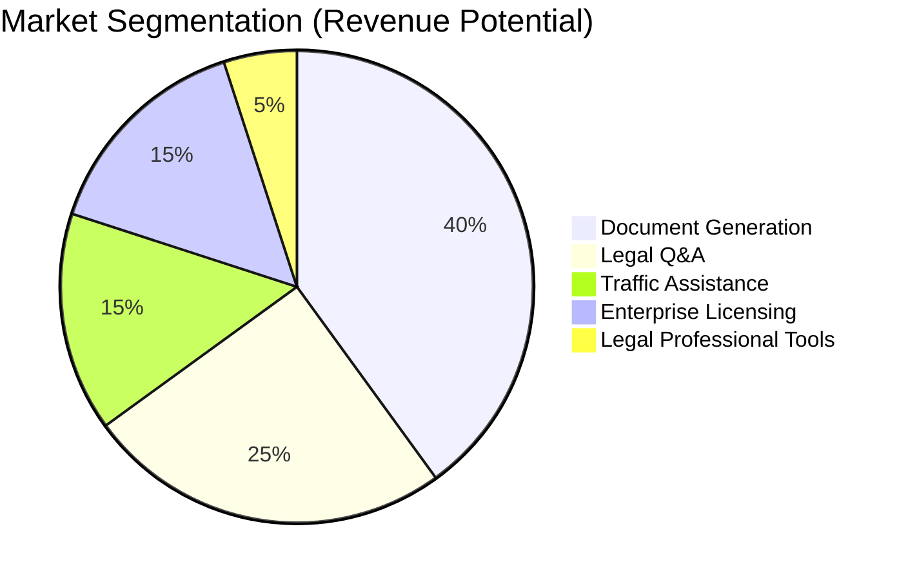

# Business Model & Market Analysis

## Executive Summary

NyayaSahayak addresses a ₹50,000+ Crore problem in India—the friction of minor legal affairs. Our agentic AI platform democratizes legal access by bridging verified government data (DigiLocker) with codified law (BNS, MVA, etc.).

---

## Market Opportunity

### The Problem in Numbers

```
┌─────────────────────────────────────────────────────────────┐
│                    MARKET SIZE (INDIA)                       │
├─────────────────────────────────────────────────────────────┤
│                                                              │
│   Population with Minor Legal Issues:                        │
│   • 70% of adults face 1+ minor legal issue annually        │
│   • ~700 Million potential incidents/year                    │
│                                                              │
│   Economic Impact per Issue:                                 │
│   • Average hidden cost: ₹3,000-7,000                       │
│     (time, travel, bribes, documentation)                   │
│   • Estimated annual impact: ₹50,000+ Crore                 │
│                                                              │
│   Current Solutions:                                         │
│   • Lawyers: ₹2,000-10,000 per consultation                 │
│   • Document services: ₹500-2,000 per document              │
│   • Time cost: 10-30 hours per issue                        │
│                                                              │
└─────────────────────────────────────────────────────────────┘
```

### Target Market Segments

| Segment | Size (India) | Primary Use Cases | Pain Level |
|---------|--------------|-------------------|------------|
| **Urban Professionals** | ~100M | Rental agreements, traffic issues | ⭐⭐⭐⭐⭐ |
| **Gig Economy Workers** | ~15M | Contracts, insurance verification | ⭐⭐⭐⭐ |
| **Students** | ~50M | Affidavits, gap certificates | ⭐⭐⭐⭐ |
| **Small Business Owners** | ~60M | Consumer complaints, licensing | ⭐⭐⭐⭐⭐ |
| **Senior Citizens** | ~100M | Property matters, wills | ⭐⭐⭐ |

### Total Addressable Market (TAM)



---

## Business Model

### Revenue Streams

#### 1. Freemium Consumer Model

| Tier | Price | Features |
|------|-------|----------|
| **Free** | ₹0 | 3 document generations/month, Basic Q&A |
| **Pro** | ₹199/month | Unlimited docs, Priority support, e-Sign integration |
| **Family** | ₹499/month | Up to 5 members, Shared document vault |

#### 2. Transaction-Based Revenue

| Action | Revenue |
|--------|---------|
| e-Stamp integration | 2% of stamp duty (₹5-100 per transaction) |
| e-Sign integration | ₹50-100 per signature |
| Notary connection | ₹100-200 referral fee |
| Lawyer referral (escalation) | 10% of first consultation |

#### 3. B2B / Enterprise

| Client | Offering | Pricing |
|--------|----------|---------|
| **HR Tech Platforms** | Employee document verification API | ₹5-10 per verification |
| **PropTech Companies** | Rental agreement generation API | ₹100-200 per agreement |
| **Legal Tech Firms** | White-label document automation | Custom licensing |
| **Banks/NBFCs** | KYC document verification | ₹10-20 per verification |

---

## Revenue Projections

### 3-Year Projection

| Metric | Year 1 | Year 2 | Year 3 |
|--------|--------|--------|--------|
| **Registered Users** | 100K | 500K | 2M |
| **Paid Users (Pro)** | 5K | 40K | 200K |
| **Documents Generated** | 250K | 1.5M | 8M |
| **Transaction Revenue** | ₹25L | ₹2Cr | ₹12Cr |
| **Subscription Revenue** | ₹12L | ₹96L | ₹4.8Cr |
| **B2B Revenue** | ₹0 | ₹50L | ₹3Cr |
| **Total Revenue** | ₹37L | ₹3.5Cr | ₹20Cr |

### Unit Economics

```
Customer Acquisition Cost (CAC): ₹50-100
Lifetime Value (LTV): ₹500-2,000
LTV/CAC Ratio: 10-20x (healthy)

Cost per Document Generated: ₹5-10 (LLM + infrastructure)
Revenue per Document: ₹50-100
Gross Margin: 80-90%
```

---

## Competitive Landscape

### Current Alternatives

| Solution | Pros | Cons |
|----------|------|------|
| **Traditional Lawyers** | Trusted, comprehensive | Expensive, slow, inaccessible |
| **Legal Marketplaces** (Vakil Search, etc.) | Connects to lawyers | Still requires human consultation |
| **Document Templates** (LegalDesk, etc.) | Self-service | No verification, manual entry, compliance gaps |
| **AI Chatbots** | 24/7, low cost | Generic advice, no action, no verification |

### NyayaSahayak Differentiators

```
┌─────────────────────────────────────────────────────────────┐
│                  COMPETITIVE MOAT                            │
├─────────────────────────────────────────────────────────────┤
│                                                              │
│  1. DigiLocker Integration                                   │
│     └── Only platform with verified govt data flow          │
│                                                              │
│  2. Agentic Automation                                       │
│     └── Agent acts, not just advises                        │
│                                                              │
│  3. Legal RAG with Citations                                 │
│     └── Every answer backed by specific Act/Section         │
│                                                              │
│  4. Zero-Retention Privacy                                   │
│     └── DPDPA compliant by design                           │
│                                                              │
│  5. Vernacular Support                                       │
│     └── Hindi + English (more languages planned)            │
│                                                              │
└─────────────────────────────────────────────────────────────┘
```

---

## Go-to-Market Strategy

### Phase 1: Community Launch (Month 1-3)

- **Target:** Tech-savvy urban professionals
- **Channel:** Product Hunt, Twitter/X, Reddit
- **Content:** "I fought a wrong challan" stories
- **Goal:** 10,000 users, 100 paying

### Phase 2: Partnership Expansion (Month 4-6)

- **PropTech Partners:** NoBroker, 99acres, Housing.com
- **HR Tech Partners:** Darwinbox, Keka, Zoho People
- **Legal Aid Partnerships:** State Legal Services Authorities
- **Goal:** 50,000 users, 2,000 paying

### Phase 3: Mass Market (Month 7-12)

- **WhatsApp Integration:** Reach non-app users
- **Vernacular Expansion:** Hindi-first interface
- **Offline Events:** Partner with RTO desks, registrar offices
- **Goal:** 500,000 users, 20,000 paying

---

## Funding Requirements

### Seed Round: ₹2 Crore

| Use of Funds | Allocation | Purpose |
|--------------|------------|---------|
| **Engineering** | 50% | 4-5 senior developers for 12 months |
| **Legal Content** | 20% | Legal expert consultants, content licensing |
| **Infrastructure** | 15% | Cloud, APIs, security audits |
| **Marketing** | 10% | Launch campaigns, content |
| **Operations** | 5% | Legal, compliance, admin |

### Milestones for Funding

1. ✅ MVP with DigiLocker integration
2. ⏳ 1,000 documents generated
3. ⏳ 100 paying users
4. ⏳ Partnership with 1 PropTech platform

---

## Risk Analysis

| Risk | Probability | Impact | Mitigation |
|------|-------------|--------|------------|
| DigiLocker API changes | Medium | High | Close monitoring, partnership discussions |
| Legal content accuracy | Medium | Critical | Expert review, guardrails, disclaimers |
| Competition from incumbents | Medium | Medium | Speed, differentiation, network effects |
| Regulatory changes (DPDPA) | Low | High | Privacy-first design, compliance roadmap |
| LLM cost increases | Medium | Medium | Model diversification, caching |

---

## Team Requirements

### Core Team (MVP)

| Role | Headcount | Key Skills |
|------|-----------|------------|
| **Full-Stack Developer** | 2 | Python, FastAPI, React, MongoDB |
| **ML Engineer** | 1 | LLM, RAG, LangChain/Graph |
| **Legal Expert** | 1 (Advisor) | Indian law, document compliance |
| **Designer** | 1 | UI/UX, mobile-first design |

### Advisory Board

- **Legal:** Retired High Court judge or senior advocate
- **Tech:** Ex-founder from DigiLocker/UIDAI ecosystem
- **Business:** Legal tech entrepreneur or investor

---

## Success Metrics

### Key Performance Indicators

| Metric | Target (Year 1) |
|--------|-----------------|
| Monthly Active Users | 50,000 |
| Documents Generated | 250,000 |
| Conversion Rate (Free → Paid) | 5% |
| NPS Score | 50+ |
| Average Resolution Time | <5 minutes |
| Legal Accuracy (audit) | 95%+ |

---

*Document prepared for hackathon submission - February 2026*
